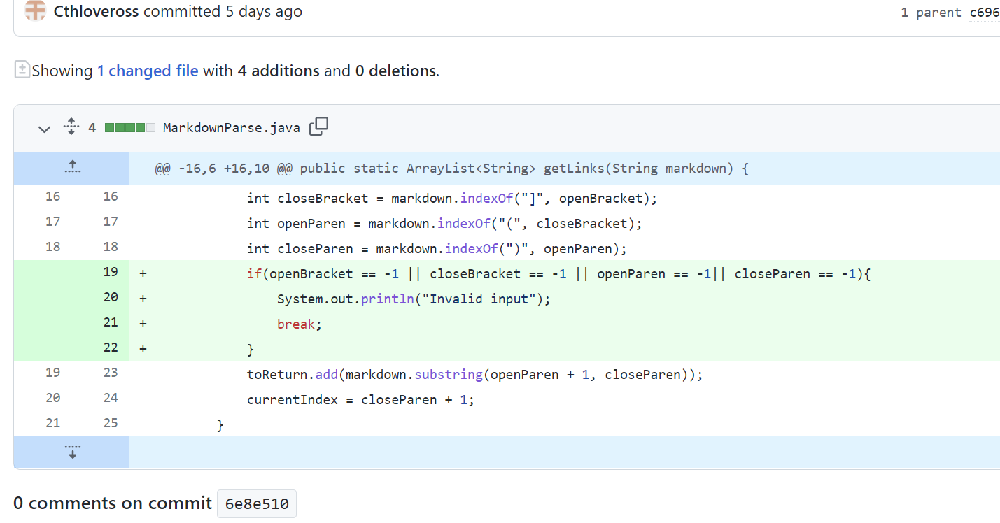
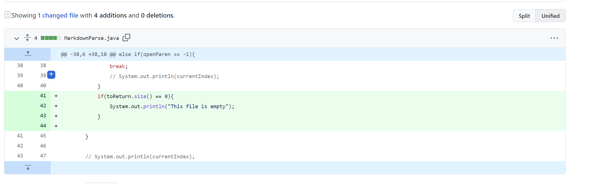
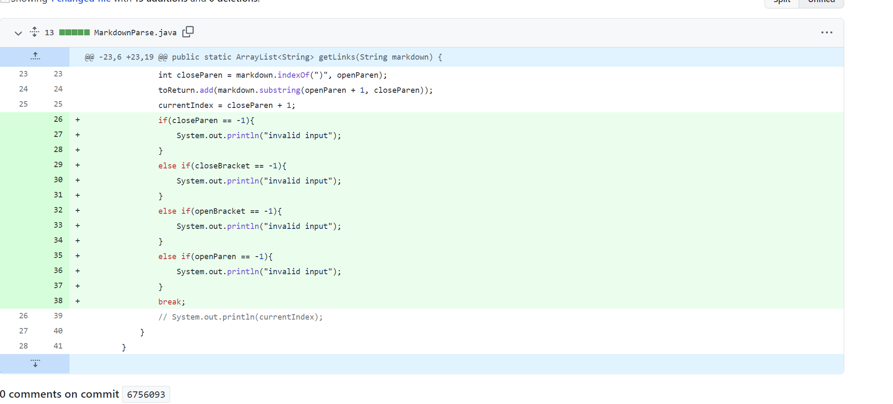

## Fisrt code change

Here is the image I made the change for the first one.

There are some texts at the last line of the testlie.
Here is the link to the first test file.
[testfile1](https://github.com/Cthloveross/markdown-parser/blob/main/testfile2.md)

## Second code change

Here is the image I made the change for the second one.

It is an empty file and it casued some problem.
Here is the link to the second test file.
[testfile2](https://github.com/Cthloveross/markdown-parser/blob/main/testemptyfile)

## Third code change

Here is the image I made the change for the third one.

It is the file with two links but the second one is lack of ")" at last.

[testfile3](https://github.com/Cthloveross/markdown-parser/blob/main/test_file_1.md)