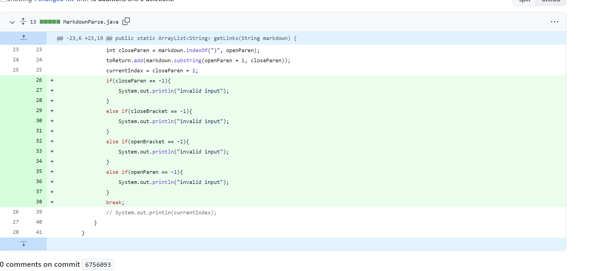

# CSE 15L Lab 2 

> __Name__ : Tianhao Chen  

> __Email__ : tic001@ucsd.edu 

## Fisrt code change

Here is the image I made the change for the first one:

**The symptom here shows that the texts cannot be recognized at the end of the file. Because the texts at the last line is not end with "] or )", so it caused the infinite loop**

Here is the screenshot of the failure-inducing input and the symptom in command line from my group member:

Here is the link to my testfile1:
[testfile1](https://github.com/Cthloveross/markdown-parser/blob/main/testfile2.md)

## Second code change

Here is the image of changed code for the second test:

**The symptom is caused by the bug in the code because I add an addtitional symbol near the link. Since the code cannot solve the last symbol ";" , it goes into the infinite loop.**

Here is the screent shot of the failure-inducing input and the symptom in command line from my group member:

Here is the link to the second test file:
[testfile2](https://github.com/Cthloveross/markdown-parser/blob/main/test-file.md)

## Third code change

Here is the image I made the change for the third one.

**The symptom here shows that it is an invalid input because this link is lack of ")" at the end, so it caused a bug. The incompeleted second link is the failure-input.**

Here is the screenshot of the failure-inducing input and the symptom in command line from my group member:

Here is the link to my testfile3:
[testfile3](https://github.com/Cthloveross/markdown-parser/blob/main/test_file_1.md)
